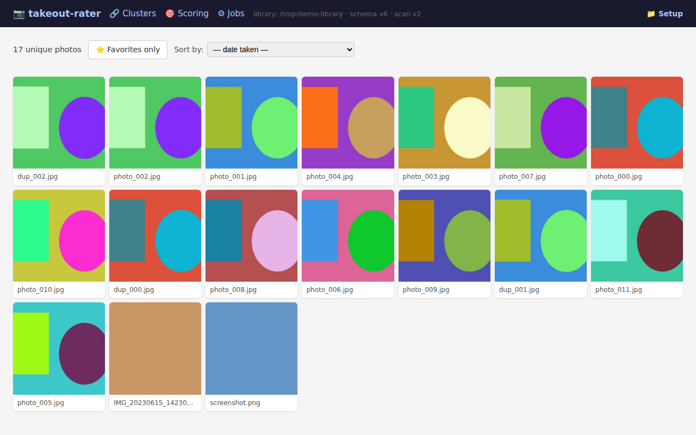
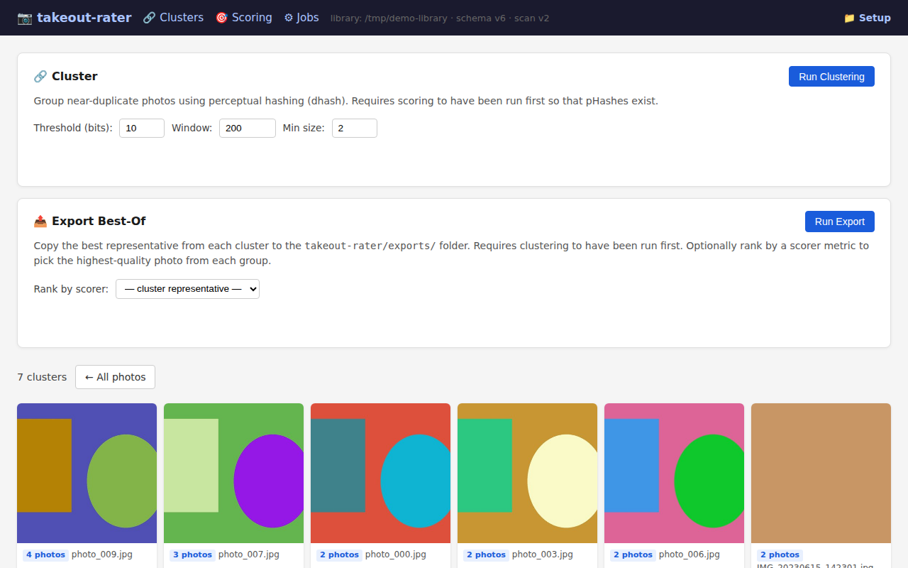
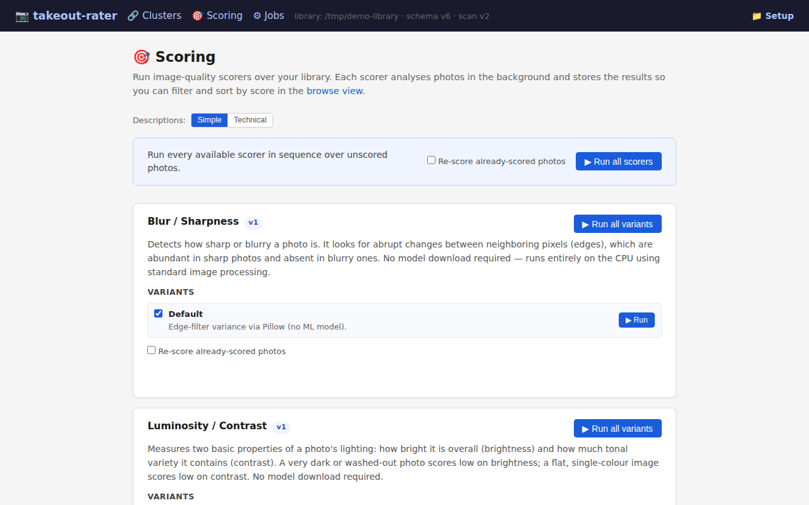
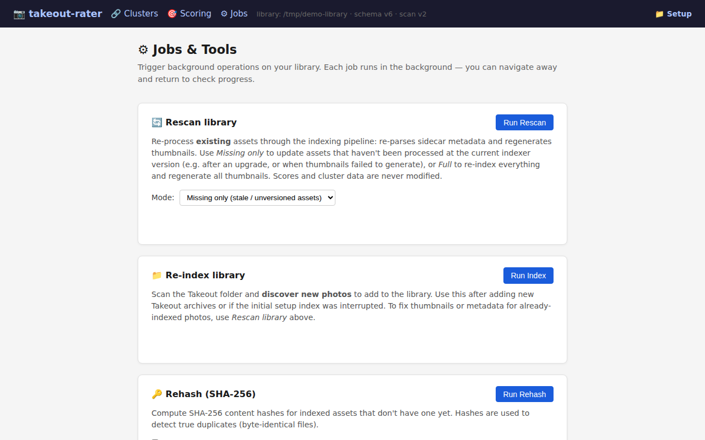

# takeout-rater

Aesthetics scoring orchestrator for Google Photos Takeout folders.

Point it at the directory containing your `Takeout/` export and it will build
a sibling `takeout-rater/` directory with a SQLite library, thumbnail cache,
and exports — without ever modifying the original archive.

---

## Quickstart (one command)

```bash
git clone https://github.com/FelixDombek/takeout-rater.git
cd takeout-rater

# macOS / Linux
./run

# Windows
run.bat
```

The launcher will:
1. Create a local Python virtual environment (`.venv/`) and install dependencies on first run.
2. Start the local web server.
3. Open your browser automatically.

**First time:** the browser will show a setup page.
Click **Browse…** (or type the path) to select the directory that *contains*
your `Takeout/` folder, then click **Save & continue**.

> **Note:** Depending on your export settings, your photos may be nested under
> `Takeout/Photos from YYYY/` directly, or under a localized subdirectory such
> as `Takeout/Google Photos/` or `Takeout/Google Fotos/`.  Either way, point
> takeout-rater at the folder that *contains* `Takeout/` — it will find your
> photos automatically and skip unrelated Google product data.

After indexing (see below), the browser shows your full photo library.

### Indexing your Takeout folder

The launcher starts the UI but does not index your photos automatically.
Run this once after setting the Takeout path:

```bash
# macOS / Linux  (uses the venv Python)
.venv/bin/python -m takeout_rater index /path/to/folder-containing-Takeout

# Windows
.venv\Scripts\python -m takeout_rater index C:\path\to\folder-containing-Takeout
```

### Changing the Takeout folder path

Open the browser and navigate to **http://127.0.0.1:8765/setup**,
or click the ⚙ setup link in the header when present.
Enter the new path and click **Save & continue**.

---

## What it does

- **Indexes** your Google Photos Takeout in place (read-only)
- **Scores** photos using pluggable scorers (aesthetic quality, perceptual hash, …)
- **Browses** your library via a local web UI with filters and sorting
- **Exports** your best photos (top-N, or best-of-cluster) to a folder

See [`docs/design.md`](docs/design.md) for the full architecture overview.

---

## Screenshots

| 📷 Browse | 🔗 Clusters |
|:---------:|:-----------:|
| [](docs/screenshots/browse.png) | [](docs/screenshots/clusters.png) |
| **🎯 Scoring** | **⚙ Jobs** |
| [](docs/screenshots/scoring.png) | [](docs/screenshots/jobs.png) |

---

## Developer quick start (manual install)

```bash
# Install in editable mode with dev dependencies
pip install -e ".[dev]"

# Launch the web UI (first-run shows setup page to select Takeout path)
takeout-rater serve
# → open http://127.0.0.1:8765 in your browser

# Or, point directly at a library root and browse
takeout-rater index /path/to/folder-containing-Takeout
takeout-rater browse /path/to/folder-containing-Takeout
# → open http://127.0.0.1:8765/assets in your browser
```

---

## Roadmap

| Iteration | Scope | Status |
|---|---|---|
| **0** | Repo foundation: design docs, ADRs, agent docs, scorer interface, CI | ✅ Done |
| **1** | Indexing, DB, thumbnail cache, minimal browse UI | ✅ Done |
| **2** | Scorer pipeline end-to-end + BlurScorer + pHash | ✅ Done |
| **3** | Clustering, cluster view, best-of-cluster export | ✅ Done |
| **4** | Aesthetic scorer (CLIP + MLP), sort by aesthetic in UI | ✅ Done |
| **5** | NSFW detector scorer, filter-by-score range, view presets | ✅ Done |
| **6** | SHA-256 deduplication, `rehash` CLI, dedupe browse UI | ✅ Done |
| **7** | UI-first: background jobs API, `/jobs` page, progress tracking | ✅ Done |
| **8** | Index as background job, `serve` CLI, setup page, rescan, DB v6 | ✅ Done |
| **9** | Timeline scrollbar, infinite-scroll lightbox navigation | ✅ Done |
| **10** | Extended scorers (BRISQUE, CLIP-IQA, NIMA, PyIQA), `/scoring` page | ✅ Done |

---

## Development setup

**Requirements:** Python 3.12+, pip

```bash
# Clone
git clone https://github.com/FelixDombek/takeout-rater.git
cd takeout-rater

# Install in editable mode with dev dependencies
pip install -e ".[dev]"
```

---

## Running lint and tests

```bash
# Format check
ruff format --check src/ tests/

# Lint
ruff check src/ tests/

# Tests
pytest
```

---

## CLI

```bash
# Show help
python -m takeout_rater --help
# or, after installing:
takeout-rater --help

# Launch the web UI (shows setup page on first run)
takeout-rater serve [--port 8765]

# Index a Takeout folder (generates DB + thumbnail cache)
takeout-rater index /path/to/library-root

# Browse the indexed library in a local web UI
takeout-rater browse /path/to/library-root [--port 8765]

# Run scorers over indexed assets
takeout-rater score /path/to/library-root [--scorer blur] [--phash]

# Group near-duplicates by perceptual hash
takeout-rater cluster /path/to/library-root [--threshold 10]

# Export best-of-cluster photos to a folder
takeout-rater export /path/to/library-root [--scorer aesthetic] [--out ./export]

# Compute SHA-256 hashes for deduplication
takeout-rater rehash /path/to/library-root
```

---

## Tools

See [`docs/tools/README.md`](docs/tools/README.md).

---

## Contributing

See [`CONTRIBUTING.md`](CONTRIBUTING.md) and the agent enablement docs in
[`docs/agents/`](docs/agents/).

---

## License

GPL-3.0-only — see [`LICENSE`](LICENSE).
